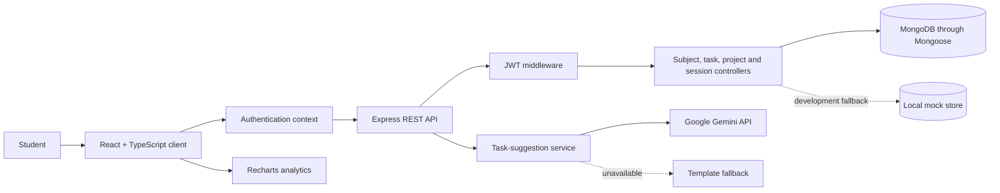
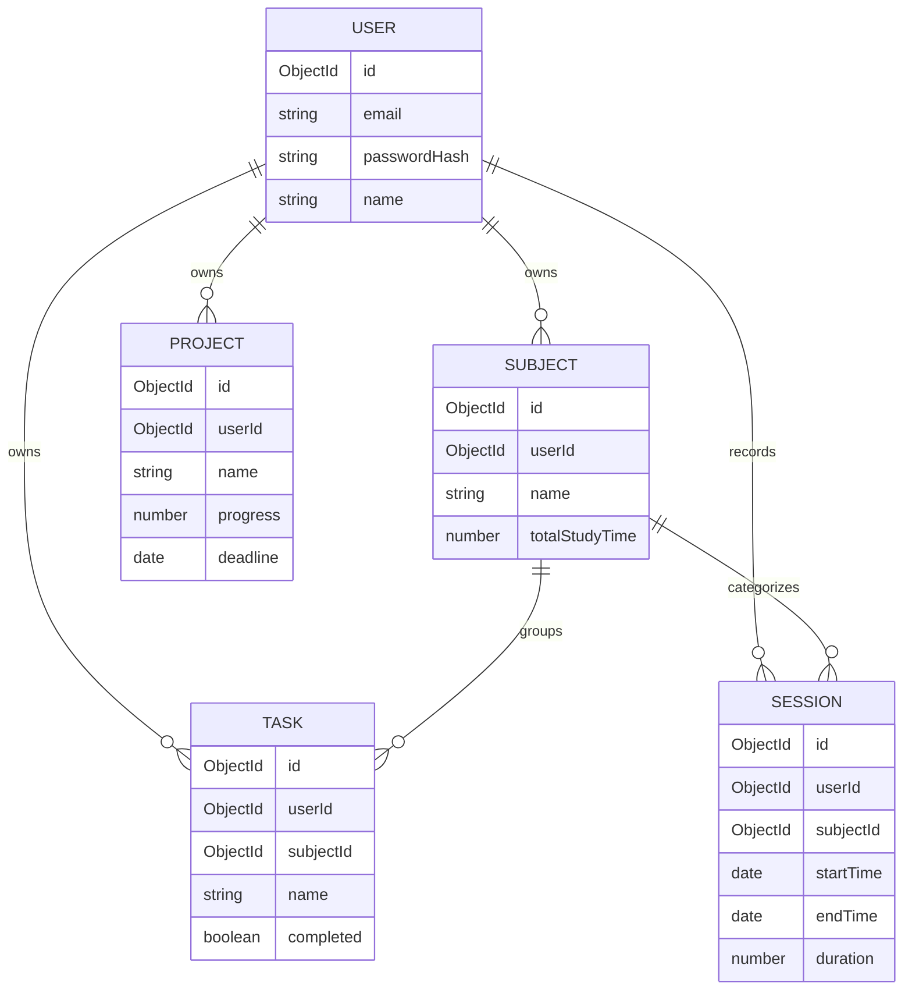

# Study Hub

[](https://react.dev/)
[](https://www.typescriptlang.org/)
[](https://expressjs.com/)
[](https://www.mongodb.com/)

Study Hub is a full-stack study-management platform for organizing subjects and tasks, recording focused study sessions, and reviewing progress through interactive analytics. It combines a React and TypeScript client with an Express API, MongoDB persistence, JWT-based authentication, and optional AI-assisted task suggestions.

> **Project status:** Academic prototype. The core planning, tracking, analytics, and persistence workflows are implemented, but the authentication recovery flow and development fallback mode require hardening before production use. See [Current Limitations](#current-limitations).

## Problem

Students often manage coursework, deadlines, study timers, and progress records across unrelated tools. This makes it difficult to answer practical questions such as:

- Which tasks require attention first?
- How much focused time has been spent on each subject?
- Is study activity improving over time?
- What specific next steps could turn a broad study goal into actionable work?

Study Hub brings these workflows into one responsive workspace.

## Implemented Features

### Study organization

- Create, view, edit, and delete subjects
- Create and organize tasks by subject
- Mark tasks as completed
- Track projects and their progress
- Review tasks through dashboard, list, and calendar-oriented views

### Focus-session tracking

- Start, pause, and end study sessions
- Associate sessions with subjects
- Store session duration and timestamps
- Summarize study activity through charts and progress indicators
- Export session information as CSV

### Accounts and personalization

- User registration and login
- BCrypt password hashing
- JWT-based access to protected study-resource routes
- Profile and password-update interface
- Light and dark themes
- Responsive desktop, tablet, and mobile layouts

### Assisted planning

- Optional Google Gemini integration for generating structured study-task ideas
- Rule-based fallback suggestions when the external AI service is unavailable
- Ability to convert a suggestion into a saved task

The AI component is an external model integration, not a custom-trained machine-learning model.

## System Architecture



## Application Workflow

1. A user registers or signs in.
2. The server issues a time-limited JWT after successful authentication.
3. The client attaches the token to protected API requests.
4. Subjects, tasks, projects, and sessions are stored with the authenticated user ID.
5. Session records are aggregated into dashboard and analytics views.
6. Users may request task suggestions and selectively save useful suggestions.

## Technology Stack

| Layer | Technology | Purpose |
|---|---|---|
| Client | React 18, TypeScript | Component-based user interface |
| Routing | React Router | Public and application navigation |
| Styling | Tailwind CSS | Responsive layouts and theming |
| Motion | Framer Motion | Interface transitions |
| Visualization | Recharts | Study-time and progress charts |
| API client | Axios | REST communication and token attachment |
| Server | Node.js, Express | Application API and business logic |
| Database | MongoDB, Mongoose | User-scoped persistent records |
| Authentication | JWT, BCrypt | Session tokens and password hashing |
| AI integration | Google Gemini REST API | Optional task-idea generation |
| Deployment | Vercel configuration | Static client and serverless API routing |

## Repository Structure

```text
Study-Hub/
├── client/
│   ├── src/
│   │   ├── charts/             # Study analytics visualizations
│   │   ├── components/         # Shared interface components
│   │   ├── context/            # Authentication state
│   │   ├── pages/              # Dashboard and feature pages
│   │   ├── utils/              # Configured API client
│   │   ├── App.tsx             # Routing and application layout
│   │   ├── main.tsx            # Client entry point
│   │   └── types.ts            # Shared client-side types
│   ├── package.json
│   └── vite.config.ts
├── server/
│   ├── controllers/            # Authentication and resource logic
│   ├── middleware/             # JWT verification
│   ├── models/                 # Mongoose schemas
│   ├── routes/                 # REST endpoint definitions
│   ├── utils/                  # Development fallback store
│   ├── app.js                  # Express application entry point
│   └── package.json
├── package.json
├── vercel.json
└── README.md
```

## Data Model



## API Overview

| Area | Method and route | Purpose | Access |
|---|---|---|---|
| Authentication | `POST /api/auth/register` | Begin registration | Public |
| Authentication | `POST /api/auth/verify-registration` | Complete registration | Public |
| Authentication | `POST /api/auth/login` | Authenticate and obtain a token | Public |
| Authentication | `PUT /api/auth/update-profile` | Update the current profile/password | Authenticated |
| Subjects | `GET/POST /api/subjects` | List or create subjects | Authenticated |
| Subjects | `PUT/DELETE /api/subjects/:id` | Modify or delete a subject | Authenticated |
| Tasks | `GET/POST /api/tasks` | List or create tasks | Authenticated |
| Tasks | `PUT/DELETE /api/tasks/:id` | Modify or delete a task | Authenticated |
| Tasks | `POST /api/tasks/:id/complete` | Toggle completion | Authenticated |
| Sessions | `GET/POST /api/sessions` | List or create session records | Authenticated |
| Sessions | `POST /api/sessions/start` | Begin a timed session | Authenticated |
| Sessions | `POST /api/sessions/pause` | Save elapsed duration | Authenticated |
| Sessions | `POST /api/sessions/end` | Finish a session | Authenticated |
| Projects | `GET/POST /api/projects` | List or create projects | Authenticated |
| AI assistance | `POST /api/ai/suggest` | Generate task suggestions | Prototype endpoint |

## Local Development

### Prerequisites

- Node.js 18 or newer
- npm
- MongoDB Community Server or MongoDB Atlas
- A Google Gemini API key only if AI-generated suggestions are required

### 1. Clone the repository

```bash
git clone https://github.com/anushka06onu/Study-Hub.git
cd Study-Hub
```

### 2. Configure the server

Create `server/.env`:

```env
PORT=5001
MONGO_URI=mongodb://127.0.0.1:27017/studyhub
JWT_SECRET=replace_with_a_long_random_secret
GEMINI_API_KEY=optional_gemini_api_key
NODE_ENV=development
```

Never commit `.env` files or API keys.

### 3. Install and start the backend

```bash
cd server
npm ci
npm run dev
```

The API is available at `http://localhost:5001` by default.

### 4. Configure the client

Create `client/.env.local`:

```env
VITE_API_URL=http://localhost:5001/api
```

### 5. Install and start the client

```bash
cd client
npm ci
npm run dev
```

The Vite development server normally opens at `http://localhost:5173`.

### 6. Create a production client build

```bash
cd client
npm run build
```

## Configuration Notes

- `JWT_SECRET` must be explicitly configured in every deployed environment.
- MongoDB should be required in production; local JSON fallback storage is intended only for development demonstrations.
- If `GEMINI_API_KEY` is missing or the external request fails, the current service returns template-based suggestions.
- Production CORS configuration should allow only the deployed client origin.

## Current Limitations

- Pending registration information is stored in process memory and is unsuitable for serverless or multi-instance production deployment.
- The client task type and the Mongoose task schema require final alignment for fields such as title, priority, and due date.
- The AI suggestion endpoint requires authentication, rate limiting, and validation before using a paid API key publicly.
- The repository does not currently include an actual license file.


## Responsible AI Use

AI-generated task ideas may be incomplete or unsuitable for a particular course. They should be treated as editable planning suggestions, not authoritative academic instructions. Study Hub does not send grades, private notes, or academic records to Gemini unless those details are included by the user in a suggestion request.

## Roadmap

- Multi-semester study goals and weekly planning
- Reminders and deadline notifications
- Editable AI suggestions with user feedback
- Calendar import/export
- Improved subject-level comparisons
- Accessible keyboard navigation and screen-reader testing
- Optional collaboration after a dedicated permissions model is designed

## Author

Developed by **Fateha Hossain Anushka**.

- [GitHub](https://github.com/anushka06onu)
- [Portfolio](https://fatehahossainanushka.vercel.app/)

## License

No license file is currently included. Add an explicit license before describing the repository as open source or permitting reuse.
